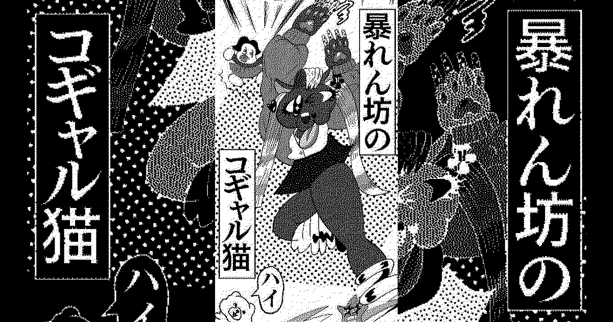

# Kindolphin



A progressive web app that gathers AC-bu's “GIF manga” works (a comics format using looping animated GIFs as the panels) into one viewer. Originally built as the interactive music video for group_inou's “HAPPENING,” and later renewed as a dedicated catalog viewer on the occasion of AC-bu's solo exhibition “GIFTOOOON.”

Designed and implemented by [Baku Hashimoto](https://baku89.com).

- Animation: [AC-bu](https://www.ac-bu.info/)
- Music: [group_inou](https://twitter.com/gal_official)
- Audio Engineering: [Yogo Yuichi](https://www.escentier.com/)

## How to make it work on your local machine

### 1. Clone the repository

```bash
$ git clone https://github.com/baku89/kindolphin
$ cd kindolphin
```

### 2. Just buy their music

1. Purchase the album at [group_inou's Bandcamp](https://gal-official.bandcamp.com/album/happy), then download the MP3 file.
2. Put the `group_inou - HAPPY - 03 HAPPENING.mp3` file into the `public/assets` directory.

### 3. Install dependencies and launch the app

```bash
yarn
yarn dev
```

## License

注意: [public](./public) ディレクトリ以下のファイルは GAL と AC部 (c) 2024 に帰属します。それ以外のファイルは MIT ライセンスのもとで公開されています。詳細は [LICENSE](./LICENSE) ファイルを参照してください。

Note that the assets under the [public](./public) directory are under the copyright of GAL and AC-bu (c) 2024. All other files in the repository are licensed under the MIT License. See the [LICENSE](./LICENSE) file for details.
